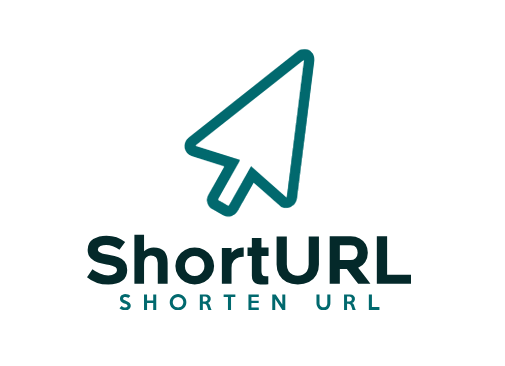

# shortURL


shortURL is a self-hosted URL shortening service that allows you to shorten URLs on your own server and under your own domain. With shortURL, you can take full control of your URL shortening service, customize it to your needs, and ensure the security and privacy of your links.

Sample : https://fare4z.com/url/

## Features
- **Custom Domain:** Use your own domain for shortened URLs.
- **Full Control:** Host the service on your own server, ensuring full control over your data.
- **QR Code Generation:** Generate QR codes for your shortened URLs.
- **Tracking:** Keep track of the number of clicks for each shortened URL.
- **Responsive Design:** The service is optimized for mobile and desktop use.

## Tech Stack

- **Framework:** CodeIgniter 4
- **Language:** PHP 8.3^
- **Database:** MySQL / MariaDB
- **Composer:** Dependency Management

## Installation

### Step 1: Clone the Repository

```bash
git clone https://github.com/fare4z/shortURL.git
cd shortURL
```

### Step 2: Install Dependencies
Make sure you have [Composer](https://getcomposer.org/) installed, then run :

```bash
composer install
```

### Step 3: Configure Environment Variables

Copy the .env.example file to .env and update the following details:

* Database Configuration: Update the database connection details (DB_DATABASE, DB_USERNAME, DB_PASSWORD) according to your environment.
* Base URL: Update the app.baseURL in the .env file to reflect your domain

### Step 4: Run Migrations

To set up the database, run the following command:
```bash
php spark migrate
```

### Step 5 : Serve the Application
You can serve the application locally using the built-in server : 
```bash
php spark serve
```
Access the application by navigating to http://localhost:8080 in your browser.

### Contributing

Contributions are welcome! Feel free to open an issue or submit a pull request.